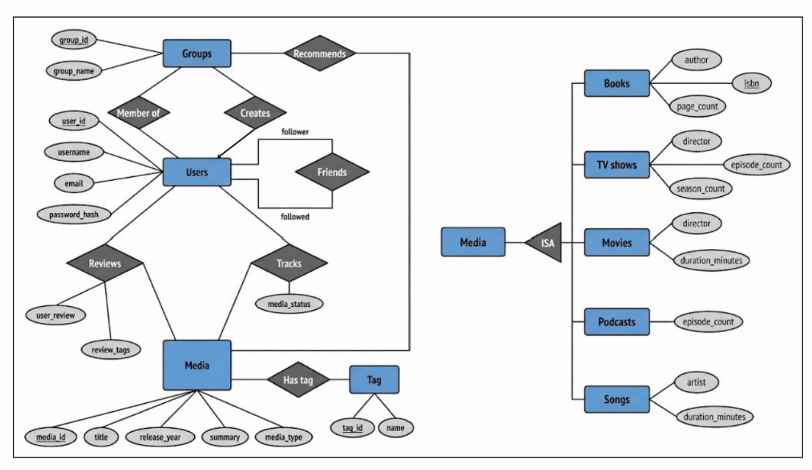

# Media Tracker: a vibe-based media recommender database

A MySQL database for finding books, TV shows, movies, podcasts and songs by **vibe**. Users tag media
with vibes such as *cozy* or *melancholy*, track and review what they consume, follow friends and
join groups that recommend media. Picking one item can suggest items of other types that share its vibes.

This repository contains the conceptual design (ERD), the normalisation work, and the relational
implementation as SQL (DDL, constraints, sample data, data loading, queries).



## Requirements

- **MySQL 8.0.16 or newer.** Older versions accept `CHECK` constraints but silently ignore them.
  Check with `SELECT VERSION();`
- The `mysql` command-line client **or** MySQL Workbench. No other software is needed.

## Repository structure

```
.
├── README.md
├── .gitattributes                    keeps the CSV files on Unix line endings
├── .gitignore
└── media-tracker/
    ├── data/                         CSV files read by load_csv.sql
    │   ├── media.csv, books.csv, movies.csv, songs.csv, has_tag.csv
    ├── docs/
    │   ├── erd/erd_full.png          entity-relationship diagram (core design + ISA hierarchy)
    │   └── normalisation.md          functional dependencies, keys and BCNF check for all 16 tables
    └── sql/
        ├── run_all.sql               builds the database, then runs the three safe demos
        │
        ├── setup.sql                 creates the media_tracker database
        ├── drop_all.sql              drops all tables (clean slate)
        ├── schema_users_groups.sql   users, friends, user_groups, member_of
        ├── schema_media.sql          media, books, tv_shows, movies, podcasts, songs, tag, has_tag
        ├── schema_activity.sql       tracks, reviews, review_tags, recommends
        ├── checks.sql                17 CHECK constraints
        ├── seed_data.sql             sample data for every table
        │
        ├── crud_operations.sql       INSERT / UPDATE / DELETE on every table
        ├── queries.sql               basic joins, filtering and sorting
        ├── alter_table.sql           ALTER TABLE demo: add a column, fill it, remove it
        ├── check_tests.sql           22 statements that are meant to be rejected by the constraints
        ├── load_csv.sql              loads new rows from ../data/*.csv
        └── queries_stretch.sql       optional recommendation queries (GROUP BY, COUNT, NOT EXISTS)
```

## Quick start (about one minute)

From the repository root:

```bash
cd media-tracker/sql
mysql -u root -p
```
```sql
SOURCE run_all.sql;
```

This creates the `media_tracker` database, builds the 16 tables, adds the constraints and sample data,
then runs the CRUD, query and ALTER TABLE demos. It prints their results and finishes with no errors.
It is safe to run again: it drops and rebuilds everything first (so it deletes the data in these tables).

**Check that it worked:**
```sql
USE media_tracker;
SHOW TABLES;                                   -- 16 tables
SELECT username FROM users;                    -- muskan, divina, grace
SELECT CONSTRAINT_NAME FROM information_schema.CHECK_CONSTRAINTS
WHERE CONSTRAINT_SCHEMA = 'media_tracker';     -- 17 rows
```

**MySQL Workbench:** `SOURCE` is not supported there. Open each file and run it (lightning-bolt button)
in this order: `setup` → `drop_all` → `schema_users_groups` → `schema_media` → `schema_activity` →
`checks` → `seed_data`. After that, `crud_operations`, `queries` and `alter_table` can be run in any order.

## What each script does

| Script | What to expect |
|---|---|
| `crud_operations.sql` | Inserts demo rows into all 16 tables (ids 801 and up), updates them, then deletes them. The database ends exactly as it began (3 users, 7 media items). |
| `queries.sql` | Two read-only queries: *pick a vibe* (media of every type with a given tag) and *group picks* (what each group recommends and who created it). |
| `alter_table.sql` | `DESCRIBE reviews`, adds a nullable `rating` column with a 1–5 CHECK, fills it for one review, then drops it again. |
| `check_tests.sql` | See below. |
| `load_csv.sql` | See below. |
| `queries_stretch.sql` | Optional. Recommendations from a picked item, from viewing history and from friends. These use `GROUP BY`, `COUNT` and `NOT EXISTS`. |

### Testing the constraints: `check_tests.sql`

Each statement is *supposed* to be rejected, and its comment says which error to expect. Run it after
`seed_data.sql`, from the `sql` folder, with `--force` so the client continues after each error:

```bash
mysql --force -t -u root -p < check_tests.sql
```

You should see **22 errors and nothing else going wrong**: twenty `ERROR 3819` (CHECK violated), one
`ERROR 1452` (foreign key to a missing parent) and one `ERROR 1451` (delete blocked because a row is still
referenced). The file ends with queries showing the data is back to the seed data. In Workbench, run the
statements one at a time and expect a red error on every `TEST`.

### Loading the CSV files: `load_csv.sql`

Adds 5 media items (ids 101–105) with their type-specific rows and tags. `LOAD DATA LOCAL INFILE` is off by
default on both the server and the client, so switch it on first. From the `sql` folder:

```bash
mysql --local-infile=1 -u root -p
```
```sql
SET GLOBAL local_infile = 1;
SOURCE load_csv.sql;
```

Run it after `seed_data.sql` (it uses the seed tags). Blank CSV fields become `NULL`, decimals such as `103.5`
load without being rounded, and running it twice does not create duplicates. Workbench instructions
are at the top of the file. If you see *"Loading local data is disabled"*, one of the two switches above is off.

## Design overview

- **16 tables in BCNF.** People: `users`, `friends`, `user_groups`, `member_of`. Media: `media`, five child
  tables, `tag`, `has_tag`. Activity: `tracks`, `reviews`, `review_tags`, `recommends`.
  The full working (keys, functional dependencies, BCNF check per table) is in `media-tracker/docs/normalisation.md`.
- **Inheritance (ISA).** `media` holds what every item has (title, year, summary, type). `books`, `tv_shows`,
  `movies`, `podcasts` and `songs` each hold only their own attributes and share `media_id` as primary key and
  foreign key to `media`. This avoids one wide table that is mostly NULL.
- **Relationships.** Many-to-many relationships (`friends`, `member_of`, `has_tag`, `tracks`, `reviews`,
  `recommends`) are link tables with composite primary keys. `friends` is a recursive relationship on `users`
  (follower and followed). *Creates* is many-to-one, so it is the column `user_groups.creator_id`.
- **BCNF decomposition.** A review's tags are multi-valued, so they live in `review_tags` instead of repeating
  the review text once per tag. `normalisation.md` section 3 shows the anomalies this removes.
- **Foreign keys** use MySQL's default behaviour: a row that other rows still point to cannot be deleted. So
  child rows are deleted first (see the DELETE section of `crud_operations.sql`), and a user who still owns a
  group cannot be deleted until the group is reassigned or removed.
- **Data types.** `INT` ids with `AUTO_INCREMENT`, `VARCHAR` for names, `TEXT` for summaries and reviews, and
  `DECIMAL(5,2)` for durations in decimal minutes (`3.50` means 3 min 30 s, not 3:50). A `NULL` means "unknown"
  (for example a book without an ISBN).
- **Constraints.** `PRIMARY KEY`, `FOREIGN KEY`, `UNIQUE` and `NOT NULL` in the schema files, plus 17 named
  `CHECK` constraints in `checks.sql` (value lists, positive counts, valid years, simple email and ISBN-length
  rules, no self-follows, no blank text).
- **Naming.** The table is `user_groups` because `GROUPS` is a reserved word in MySQL 8. `password_hash` stores
  a hash, never a plain password; the values in the sample data are fake placeholders.

## Known limitations

- **ISA type is not enforced across tables.** Nothing stops a media item of type `movie` from also having a row
  in `books`; a `CHECK` cannot compare two tables. The last part of `check_tests.sql` demonstrates it.
- **Simple validation only.** The email check is a pattern (`x@y.z`, no spaces, one `@`) and the ISBN check only
  tests for 10 or 13 characters.
- **Sample data is illustrative.** Titles are real, but some counts and durations are placeholders.
